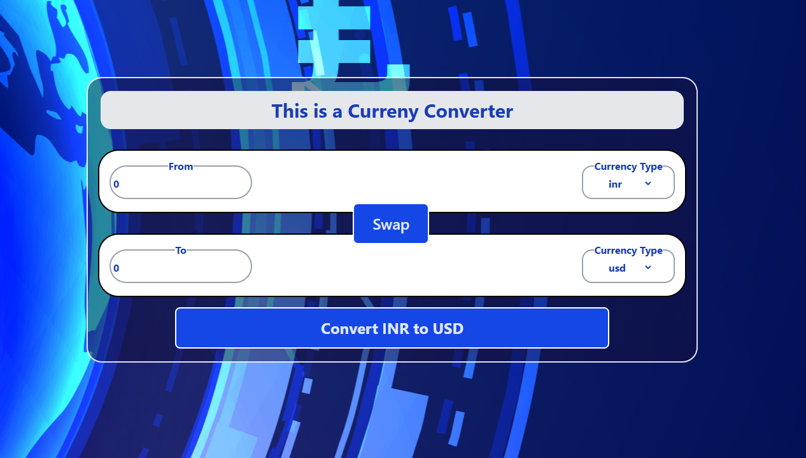

Got it! Here's the **entire `README.md` code in a single block**, ready to be copied and pasted into your project without breaking it into sections:

`````markdown
# 💱 React Currency Converter

A simple, modern currency converter built using **React**, **custom hooks**, and **Tailwind CSS**. It fetches real-time exchange rates and allows bidirectional conversion between any two currencies.

---

## 🔥 Features

- Live exchange rate fetching via custom hook (`useCurrencyInfo`)
- Controlled form inputs for better UX
- Currency swap functionality
- Reusable `InputBox` component
- Styled using Tailwind CSS
- Responsive design

---

## 📂 Project Structure

```bash

currency-converter/
├── public/
│ ├── index.html
│ └── Screenshot.png
├── src/
│ ├── components/
│ │ └── InputBox.jsx
│ ├── hooks/
│ │ └── useCurrencyInfo.js
│ ├── pages/
│ │ └── Container.jsx
│ ├── App.jsx
│ ├── index.css
│ └── index.jsx
├── .env
├── package.json
└── README.md
```
`````

---

## ⚙️ Setup Instructions

```bash
# 1. Clone the repository
git clone https://github.com/tejas-kangule/currency-converter.git
cd currency-converter

# 2. Install dependencies
npm install

# 3. Run the app
npm run dev
```

Visit the app at: [http://localhost:5173](http://localhost:5173)

> # 💡 This app uses the [fawazahmed0 currency API](https://github.com/fawazahmed0/currency-api) which doesn't require an API key. Currency codes like `usd`, `inr`, etc., are supported.
>
> 

```bash
npm run dev

```

> You can get a free API key from [ExchangeRate API](https://cdn.jsdelivr.net/npm/@fawazahmed0/currency-api@latest/v1/currencies/${currency}.json) or a similar service.
> currecy can be usd or inr any available

### 3. Run the App

```bash

npm run dev

App will be available at `http://localhost:5173`.

```

## 🧠 How It Works

- `useCurrencyInfo(baseCurrency)`: Fetches exchange rates from the selected base currency.
- `Container.jsx`: Manages state for amount, source/target currencies, and conversion logic.
- `InputBox.jsx`: A reusable component for currency input with dropdown and input field.

---

## 🖼️ UI Preview


---

## 🧩 Technologies Used

- ⚛️ React + Vite
- 💨 Tailwind CSS
- 🧠 Custom React Hooks
- 🌍 Open Currency API

---

## ✅ To-Do

- [ ] Add loading and error handling
- [ ] Add formatting (commas, symbols)
- [ ] Write unit tests
- [ ] Add dark mode toggle

---

## 🧑‍💻 Contributing

```bash
# Steps to contribute:
1. Fork this repo
2. Create your branch: git checkout -b feature/AmazingFeature
3. Commit: git commit -m 'Add some AmazingFeature'
4. Push: git push origin feature/AmazingFeature
5. Submit a Pull Request
```

---

## 🙋‍♂️ Author

**Tejas Kangule**
Integrated B.Tech + MBA, ABV-IIITM Gwalior
[GitHub – tejas7410](https://github.com/tejas7410)

---

> Made with ❤️ using React & Tailwind CSS
